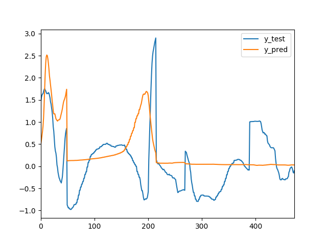

# Volatility Prediction with macroeconomic announcements

### Question:

***We assume that the best prediction of the volatility of an FX rate over the next 60 minutes is  the historic volatility of that FX rate over the previous 60 minutes.
We now wish to enhance that volatility prediction by incorporating what is known about upcoming economic events (from the dataset provided by www.forexfactory.com).
Please propose, in as much detail as you can, a method for incorporating the economic events information into the volatility prediction.
Kindly include your explanation of the model and code if you have any.***

### Answer:

As per findings in [Literature](papers/README.md), there is indeed effects on volatility of the FX rate when there is planned or unplanned economic events.

Before we proceed to discuss on the effects, first let look into the mind of a trader. Since a trader is a human, there are two cognitive bias: **Greed** and **Fear** which influenced the trader.

Then the traders in his own personal beliefs believes that economic events will interference the  market, the trader will choose **not facing the uncertainties vs loading off his position** before the announcements of economic events. (***Before the announcements-Fear***)

Then again, the trader is so sure of himself or herself that economic announcements will be in his or her favor, the trader  will choose **to high load the position**. (***Before the announcements-Greed***)

Therefore, from that analysis, it can be assumed that the effects on volatility might be taking place **before and during** on high peak, and  **after** while the market is trying to correct in order to reflect the announcements.

After carefully [Literature](papers/README.md) analysis, I have found that **LSTM** model is performaing better than **GARCH** which normally used in such prediction.

#### Experiment

As an experiment, I have selected simple **LSTM** model to train and test for  EURUSD one week data gather from **Yahoo Finance**.
And As for economic event data, I have gather info from **Investing.com**.

As for current experiment, I only focused on impact level of announcements for economic events.

#### Economic events - Week 25 2019

1. Impact Level **High** ==> 3
   Impact Level **Median** ==> 2
   Impact Level **Low** ==> 1

2. If there is one than one announcements going to make  with the same timestamp, then take the **MAX** impact value.

3. The value will be expanded into within 60 mins timeframe.
  For example, if there is announcements on 9:00 AM with the impact value will be spreading out between 8:30 AM to 9:30 AM.

#### EURUSD FX data - Week 25 2019

I have gathered one mins interval data for EURUSD from Yahoo Finance.

### Result Discussion

I have run experiment with  LSTM models with volatility data.

Both models are expired along with volatility data plus economic event announcements data.

### Model Without Economic event

### Model With Economic event

### Limitation

1. More data might make better performance.

2. Currently, only utilized one info from economic events.

3. Different hyper parameters tuning might be improved the performance.
